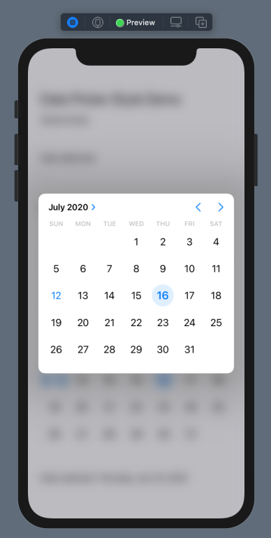

# iOS 14 Date Picker New Features 

A new date picker style is available in iOS 14. This is the GraphicalDatePickerStyle. This brief tutorial is on an interesting feature of this style. The default style also has a different behavior from earlier iOS versions. To demonstrate, we create a project with the code:

In the case of the default style, if we tap on the date, a popup appears in month view permitting us to change the date.

For the Graphical style used by the second date picker, we can use < > to navigate to a new month and tap on > to change the > button to change the month view to wheel view. The screen shots display these:

 

The left screen shot shows when the app is launched and the right screen shot when we tap the top date picker that uses the default style.

For the graphical style:

 

The left screen shot shows when we have changed the month by using the < > button and right screen shot when we change the display to wheel style by using the > button
